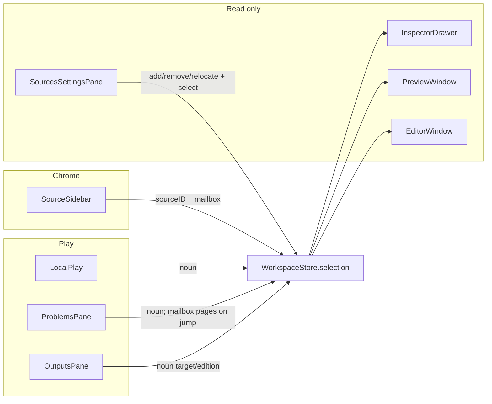
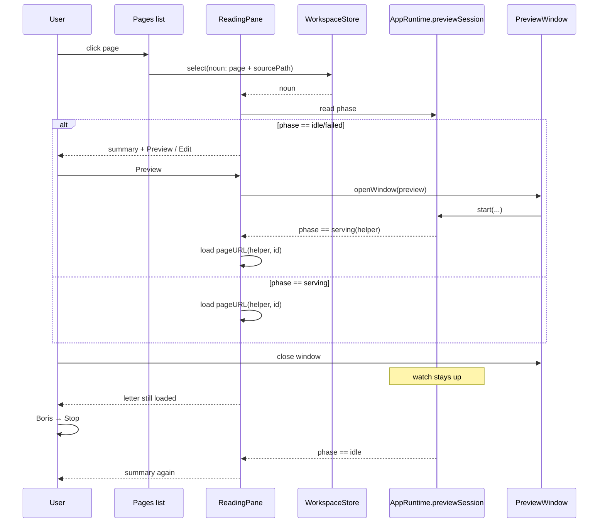
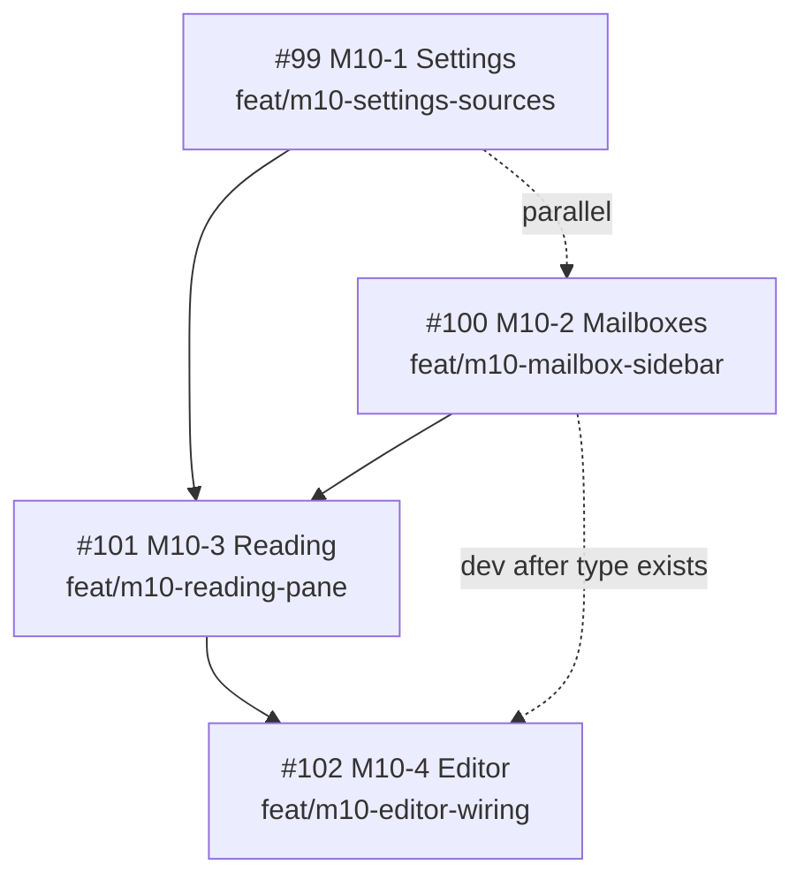

# M10 Mail Body — Implementation Design

| Field | Value |
|-------|--------|
| **Title** | M10 Mail Body — Implementation Design |
| **Author** | Solipsist design lane |
| **Date** | 2026-08-18 |
| **Status** | Accepted |
| **Repo** | [drawmeanelephant/solipsist](https://github.com/drawmeanelephant/solipsist) |
| **Parent issue** | [#98](https://github.com/drawmeanelephant/solipsist/issues/98) |
| **Children** | [#99](https://github.com/drawmeanelephant/solipsist/issues/99) Settings · [#100](https://github.com/drawmeanelephant/solipsist/issues/100) Mailboxes · [#101](https://github.com/drawmeanelephant/solipsist/issues/101) Reading · [#102](https://github.com/drawmeanelephant/solipsist/issues/102) Editor |
| **Parents** | [`HARNESS.md`](HARNESS.md) §2 (spatial) · [`ROADMAP.md`](ROADMAP.md) §5 M10 · [`Agents.md`](../Agents.md) |

This is the extra planning [#98](https://github.com/drawmeanelephant/solipsist/issues/98) asked for. It is not a restatement of the cards. The four child cards, **HARNESS §4**, and the parent sequence are patched to match this file — **HARNESS wins on where a surface lives; the cards plus this design execute it.**

Implementation stays on new feature branches off `main`, one per card.

---

## Overview

M2–M8 shipped a flatter chassis: a flat `SourceSidebar`, a segmented `PlayTab` picker inside `LocalPlay`, Preview/Editor as source-scoped companions, and no Settings scene. HARNESS §2 is now the destination: Settings holds the account book, the left column is account headers plus mailboxes, the center is a message list plus a reading pane, Edit opens hosted `boris-editor` from the selected page.

The code already has the seams this recut fills. `WorkspaceStore` is the one observable inventory. `WorkspaceSelection` is a value the drawer and companions only read. The Preview companion’s `PreviewSession` (`@State` on `PreviewWindow` today) owns that window’s `WatchServer`; after M10-3 it is lifted and bound to the selected source. `EditorSession` already owns the one `boris-editor` host. None of those need a second process, a second store, or a Swift Markdown renderer.

What is missing is the Mail body: a `mailbox` field on selection, a Settings scene over the same store, a recut sidebar, a reading pane that *observes* the existing watch, and an Edit verb that surfaces `sourcePath` because `boris-editor` has no fact-checked file-open deep link.

---

## Background & Motivation

### What ships today

| Surface | File | Behavior |
|---------|------|----------|
| Selection | `Sources/Workspace/WorkspaceSelection.swift` | `sourceID` + `noun`. No mailbox. |
| Persistence | `Sources/Workspace/WorkspacePersistence.swift` | `PersistedWorkspace { sources, selected }` at UserDefaults key `solipsist.workspace.sources.v1`. Noun is not stored. `select(_:)` itself does not persist — only `addLocal` / `relocate` / `remove` call `persist()`. |
| Sidebar | `Sources/Chrome/SourceSidebar.swift` | `List(selection: Binding<SourceID?>)` of flat sources. Relocate context item only when `!item.isAvailable`. |
| Center | `Sources/Play/Local/LocalPlay.swift` | `@State selectedTab: PlayTab` segmented control. Tabs are view-local; they are not selection. |
| Preview | `Sources/Companions/Preview/PreviewWindow.swift` | `@State private var session = PreviewSession()`. `onDisappear` calls `session.stop()`. Window-local; Play cannot see it. |
| Editor | `Sources/Companions/Editor/EditorWindow.swift` | Source-scoped `EditorSession`. Header shows source title + folder path. `EditorURL` requires `#token=<hex>` and nothing else. |
| App | `Sources/App/SolipsistApp.swift` | `@State private var store = WorkspaceStore()` injected into `WindowGroup`s. No `Settings` scene. `Sources/App/Settings/` does not exist. |
| Toolbar / menu | `MainWindow.swift`, `Commands.swift` | Editor and Preview enabled whenever `selectedSource != nil`. Inspector `PageSection.openEditor()` already calls `openWindow(id: CompanionID.editor)`. |

### Pain

The window is Mail-shaped and behaves like a tabbed workbench. Clicking a source does not pick a mailbox. The letter is a companion window, not the selected message. Edit opens the project, not the page. Sources are added by a sidebar plus button, not an account book.

### Locked destination (do not reopen)

```
Settings → Sources (the account book; not a column)

┌──────────────────┬─────────────────────────────┬──────────────────┐
│ MAILBOXES        │ READING                     │ DRAWER           │
│ Source as        │ Message list + reading      │ Profile, page    │
│ account header;  │ pane for the selected       │ fields, options  │
│ folders under it │ message                     │                  │
└──────────────────┴─────────────────────────────┴──────────────────┘
Companions: Preview (full site) · Editor (boris-editor)
Native buffer: named Later, not this milestone.
```

Mail, not Finder, not Xcode. Nested folders under Pages come from `graph.json` `parent` only — and **not in this milestone** (see Key Decisions).

---

## Goals & Non-Goals

### Goals

1. Settings → Sources adds / relocates / removes local sources against the same `WorkspaceStore` as File → Open….
2. Left column is account headers + five mailboxes. Chrome writes `sourceID` + `mailbox`.
3. Center switches on `selection.mailbox`. Pages is a graph list plus a reading pane. Other mailboxes are the existing full-height panes.
4. Reading pane loads the selected page's served URL when watch is up; otherwise a contract-backed summary. No `file://`. No Swift Markdown. No second `Process`.
5. File → Edit Page / toolbar / double-click / Return open the hosted editor and surface title + `sourcePath`. No invented deep link.
6. Every PR: `SKIP_EMBED_BORIS=1 make build` + `make test` green. One card = one worktree = one PR.

### Non-Goals

- M9 ship (#78): `scripts/embed-boris.sh`, **all of** `Project.yml` (entitlements *and* target membership), release paths.
- Native `NSTextView` / `TextEditor` buffer.
- GitHub as a source.
- Walking `content/` as a Finder tree; showing `.boris/`, `themes/`, `dist/` as mailboxes.
- Nested Pages trunk folders in the sidebar (later; see §Mailbox sidebar).
- Reimplementing coordinator verbs, publish, or contracts.
- Pin bump / A1 `--watch-json` as a reading-pane dependency.
- An app-side HTTP server.
- Growing `MainWindow` with views. #100 is the sole M10 owner of that file (column width + Editor toolbar enablement). #102 does not edit it.

### Hard constraints (repeat so implementers cannot miss them)

1. Never touch the `boris` repo. Never reimplement Boris semantics in Swift.
2. Never silently ignore diagnostics or exit codes.
3. Never mutate the user’s content tree except on an explicit save.
4. One `Process?` slot in `BorisEngine`. Cancel = `Process.terminationReason == .uncaughtSignal`.
5. Do not grow `MainWindow`. Fill `Play/`, `Inspector/`, `Companions/`, `App/Settings/`. Recut `SourceSidebar`; do not start a second sidebar.
6. D2: output-changing settings write `boris.json`; machine state writes the plist; Settings and the drawer are views, never a third store.
7. Unknown/newer `schemaVersion` degrades, never crashes (D8).
8. Menus first. If it is not in the menu bar, it is not a feature.

---

## Key Decisions

| # | Decision | Rationale |
|---|----------|-----------|
| D-S1 | `WorkspaceSelection` grows `mailbox: String? = nil`. The five M10 tokens live as `WorkspaceMailbox` static strings (`pages` · `outputs` · `publish` · `plan` · `activity`), not a closed Swift enum. **M10 UI admits only those five**; unknown → Pages *display* without writing `pages` back. Persist the **raw** string. | Cards and HARNESS: open string. A later trunk card must stop treating unknown as Pages *before* it persists a trunk id. M10 will not round-trip trunks; that is explicit, not future-proofing. |
| D-S2 | `WorkspaceNoun` grows `sourcePath: String? = nil`. | Play already has `PlayPage.sourcePath`. Editor and the reading summary need it. Noun is not persisted. M10-2 lands the field; M10-3 is the only writer (list, problems jump, graph reload); M10-4 reads it. **#102 merges after #101.** |
| D-S3 | Mailbox **does** persist across relaunch, on `PersistedWorkspace.mailbox: String? = nil`, same UserDefaults key `solipsist.workspace.sources.v1`. Noun does **not**. No per-source mailbox map. | Machine state (D2). Missing key decodes as `nil`. Switching source writes `pages` (card gate). Do **not** canonicalize on load — a future trunk id must survive an M10 binary that later `persist()`s. |
| D-S4 | `select` persists only when the in-memory selection actually changed. Today's `select(_:)` does not write defaults — a sidebar click is lost on quit. Persist-on-select rewrites the **full** payload, including `LocalSource.bookmarkData`. | Behavior change for `selected`, not only mailbox. Extract `WorkspaceSelectionRules` so ContractTests do not compile `WorkspaceStore`. Never edit `Project.yml`. |
| D-S5 | Source change or mailbox change clears `noun`. Graph reload that no longer contains `noun.id` clears `noun`; if the id remains, rewrite title + `sourcePath`. Header click writes `sourceID` + `pages`. | Card gate + Mail "leaving the folder drops the message." Same-id path refresh keeps Edit caption honest. |
| D-S6 | Sidebar is `List` + `Section` per source, five tagged child rows. Selection type is `MailboxRowID` (`sourceID` + `mailbox`). **Not** `OutlineGroup` / `DisclosureGroup`. Nested trunks **out of M10**. Expansion is not persisted. Header tap is best-effort; Pages row is the accessible control. | Chrome must not decode `graph.json`. macOS `Section` header + `onTapGesture` is flaky. |
| D-S7 | Settings scene in `SolipsistApp` gets the same `@State store` via `.environment(store)`. No singleton. **#99 does not edit `Commands.swift` or `Project.yml`.** | System Settings… is the menu. Filed card M10-1 is patched to match. |
| D-S8 | Lift `PreviewSession` onto `AppRuntime`. Named recut: #101 may substitute the session owner, expose `boundRootPath`, add `PreviewURL` helpers, and bind the session from `PlayHost`. It may not change `WatchServer` argv or add a second session. `PlayHost` (always alive) retargets or stops on `sourceID` change **even when the companion is closed**. Reading pane observes and treats a root mismatch as idle. | Window-local `@State` cannot follow the sidebar. HARNESS §3: one watch per selected source. Do not grow `MainWindow`. |
| D-S9 | Page URL = loopback origin of the helper URL + `/{graph node id}.html`. **Not** `sourcePath` with the extension swapped. Mapping is a Solipsist rule, not a probed watch field. | `GraphNode` has no permalink. ENGINE-CONTRACTS §1 says `GET /<page>.html` without defining `<page>`. Id-vs-stem was not live-probed; hand-gate if a cook corpus is available. |
| D-S10 | Center split is **stacked** (`VSplitView`: list above letter). Other mailboxes are full-height existing panes. | The center is already the `NavigationSplitView` detail; a further H-split plus inspector is too tight at `minWidth: 800`. |
| D-S11 | Reading pane does **not** subscribe to SSE. It loads the page URL and reloads when `serveURL` changes **or** the user re-selects the row. 404 / load failure is in-pane summary, via `WKNavigationDelegate`. | Helper page owns EventSource. `WKWebView` reports many 404s as successful navigations — detect status explicitly. |
| D-S12 | `boris-editor` has **no** file-open query/fragment. Do not invent one. Do not file `docs/issues/boris-A*-editor-open-file.md` in this milestone. Companion header shows title + `sourcePath`. | A14 + `EditorURL` + `docs/issues/README.md`. |
| D-S13 | Recut M10-4 off `LocalPlay.swift` **and** `MainWindow.swift`. M10-3 lands double-click / Return. M10-4 owns File → Edit Page and `EditorWindow` header. `#102` **merges after `#101`.** | HARNESS §4. After the recut, only #101 writes `noun.sourcePath`; merging #102 first fails the header gate. |
| D-S14 | Merge order: #99 ∥ #100, then #101, then #102. #102 *development* may start after #100 (type has `sourcePath`); #102 *merge* after #101. #100 is the sole `MainWindow` owner. | Settings is disjoint if it stays off Commands / Project.yml / SourceSidebar. |
| D-S15 | Durable copy: `docs/M10-DESIGN.md`. **Design-lane patches HARNESS §4 (four M10 rows + sequence) and the four child cards’ Owns / Do-not-touch / Gate** (not one-line pointers). | HARNESS says it wins when docs disagree. An unpatched §4 re-opens the file collisions. |
| D-S16 | Do not add `WorkspaceStore.swift` to ContractTests. Do not edit `Project.yml`. Test selection rules via `WorkspaceSelectionRules` in `WorkspaceSelection.swift` (already in the test target). | `WorkspaceStore` pulls `AppRuntime` → `Coordinator` → AppKit / `NSDocumentController`. `Project.yml` is a #78 path. |

---

## Proposed Design

### 1. Selection model

#### Shape after M10

`Sources/Workspace/WorkspaceSelection.swift`:

```swift
/// M10 mailbox tokens. Open vocabulary — not a closed enum.
/// M10 UI admits only `all`; unknown values display as Pages
/// without being rewritten to `pages` in the plist.
enum WorkspaceMailbox {
    static let pages = "pages"
    static let outputs = "outputs"
    static let publish = "publish"
    static let plan = "plan"
    static let activity = "activity"

    static let all: [String] = [pages, outputs, publish, plan, activity]
    static let defaultMailbox = pages

    static func isKnown(_ raw: String?) -> Bool {
        guard let raw else { return false }
        return all.contains(raw)
    }

    /// M10 display/switch value. Does **not** write back.
    /// A later trunk card must stop using this for persist.
    static func display(_ raw: String?) -> String {
        guard let raw, isKnown(raw) else { return defaultMailbox }
        return raw
    }

    static func displayName(_ raw: String) -> String { /* Pages / Outputs / … / raw */ }
    static func symbolName(_ raw: String) -> String { /* doc.text / … / folder */ }
}

struct WorkspaceSelection: Hashable, Sendable, Codable {
    var sourceID: SourceID?
    /// Open string. Persist raw. Nil when no source is selected.
    var mailbox: String? = nil
    var noun: WorkspaceNoun?

    var canEditPage: Bool { noun?.kind == "page" }

    static let empty = WorkspaceSelection(sourceID: nil, mailbox: nil, noun: nil)
}

struct WorkspaceNoun: Hashable, Sendable, Codable {
    var kind: String
    var id: String
    var title: String
    /// Content-root-relative path from `GraphNode.sourcePath`. Page nouns only.
    var sourcePath: String? = nil
}

/// Pure selection transitions. `WorkspaceStore` calls these, then
/// `persist()` if the value changed. ContractTests compile this file
/// already — do not add `WorkspaceStore.swift` to the test target.
enum WorkspaceSelectionRules {
    static func selectSource(_ current: WorkspaceSelection, id: SourceID?) -> WorkspaceSelection {
        var next = current
        let changed = current.sourceID != id
        next.sourceID = id
        if id == nil {
            next.mailbox = nil
            next.noun = nil
        } else if changed {
            next.mailbox = WorkspaceMailbox.defaultMailbox
            next.noun = nil
        }
        return next
    }

    static func selectMailbox(_ current: WorkspaceSelection, mailbox: String) -> WorkspaceSelection {
        guard current.sourceID != nil else { return current }
        // Store what chrome wrote (one of `all` in M10). Do not coerce unknown → pages.
        guard current.mailbox != mailbox else { return current }
        var next = current
        next.mailbox = mailbox
        next.noun = nil
        return next
    }

    static func select(_ current: WorkspaceSelection, id: SourceID, mailbox: String) -> WorkspaceSelection {
        var next = current
        let sourceChanged = current.sourceID != id
        let mailboxChanged = current.mailbox != mailbox
        next.sourceID = id
        next.mailbox = mailbox
        if sourceChanged || mailboxChanged {
            next.noun = nil
        }
        return next
    }

    static func restore(selected: SourceID?, mailbox: String?, available: Set<SourceID>) -> WorkspaceSelection {
        guard let selected, available.contains(selected) else {
            return .empty
        }
        // Raw mailbox. Do not run `display` here.
        return WorkspaceSelection(sourceID: selected, mailbox: mailbox, noun: nil)
    }
}
```

Synthesized `Codable` keys (do not add a custom `CodingKeys` unless a rename is required):

| Type | Keys |
|------|------|
| `WorkspaceSelection` | `sourceID`, `mailbox`, `noun` |
| `WorkspaceNoun` | `kind`, `id`, `title`, `sourcePath` |

`sourcePath` is optional; a payload without it decodes as `nil`. `WorkspaceSelection` is Codable today but is **not** the persisted payload — `PersistedWorkspace` is. Noun stays session-only.

#### Persistence

`Sources/Workspace/WorkspacePersistence.swift`:

```swift
struct PersistedWorkspace: Codable, Equatable, Sendable {
    var sources: [LocalSource]
    var selected: SourceID?
    var mailbox: String? = nil    // default so existing memberwise call sites compile
}
```

Keep the same key. `mailbox` defaults to `nil` so `PersistedWorkspace(sources:selected:)` in today's `persist()` and `WorkspacePersistenceTests.testPersistedWorkspaceRoundTripViaDefaults` still compile. `LocalSource` keeps its explicit `CodingKeys` (`id`, `title`, `bookmarkData`, `displayPath`) — `isAvailable` stays transient. `PersistedWorkspace` / `WorkspaceSelection` keep **synthesized** keys (`sources`, `selected`, `mailbox`).

Do not bump the key. Do not persist `noun`. Do not persist a `[SourceID: String]` map.

Exact `persist()` / `load()` in `WorkspaceStore` (today lines 186–228):

```swift
private func persist() {
    let locals: [LocalSource] = sources.compactMap { item in
        if case .local(let local) = item { return local }
        return nil
    }
    let payload = PersistedWorkspace(
        sources: locals,
        selected: selection.sourceID,
        mailbox: selection.mailbox      // raw; do not run display()
    )
    do {
        defaults.set(try WorkspacePersistence.encode(payload), forKey: WorkspacePersistence.defaultsKey)
    } catch {
        lastError = String(describing: error)
    }
}

private func load() {
    guard let data = defaults.data(forKey: WorkspacePersistence.defaultsKey) else { return }
    do {
        let payload = try WorkspacePersistence.decode(data)
        var refreshed = false
        sources = payload.sources.map { /* beginAccess, same as today */ }
        let available = Set(sources.map(\.id))
        selection = WorkspaceSelectionRules.restore(
            selected: payload.selected,
            mailbox: payload.mailbox,    // raw
            available: available
        )
        if refreshed { persist() }
    } catch {
        lastError = String(describing: error)
    }
}
```

**Migration tests** (on `PersistedWorkspace`, no `WorkspaceStore`):

| Direction | Payload | Expect |
|-----------|---------|--------|
| Backward | v1 JSON without `mailbox` | `mailbox == nil` |
| Forward | JSON with `"mailbox":"outputs"` decoded by a type that only has `sources`/`selected` (or `JSONSerialization` ignoring extras) | no throw; old fields intact |
| Round-trip | `"mailbox":"guides/overview"` (future trunk) | string preserved; **not** rewritten to `pages` |

`JSONDecoder` ignores unknown keys by default, so an old binary can read a new plist. A new binary reads an old plist as `mailbox == nil`. UI then `display(nil)` → Pages.

#### Store API

`Sources/Workspace/WorkspaceStore.swift`. All mutations stay `@MainActor`. Views never assign `selection.mailbox` except through these methods.

```swift
func select(_ id: SourceID?) {
    let next = WorkspaceSelectionRules.selectSource(selection, id: id)
    guard next != selection else { return }
    selection = next
    persist()
}

func select(mailbox: String) {
    let next = WorkspaceSelectionRules.selectMailbox(selection, mailbox: mailbox)
    guard next != selection else { return }
    selection = next
    persist()
}

/// Sidebar write path. Header click passes `mailbox: WorkspaceMailbox.pages`.
func select(_ id: SourceID, mailbox: String) {
    let next = WorkspaceSelectionRules.select(selection, id: id, mailbox: mailbox)
    guard next != selection else { return }
    selection = next
    persist()
}
```

`select(noun:)` stays as today — no persist, no mailbox touch.

Persist-on-select is **not** a mailbox-only change. Today's `selected` is only written from `addLocal` / `relocate` / `remove`. After this, every *changed* sidebar click rewrites the full `PersistedWorkspace`, including every `LocalSource.bookmarkData` (binary). That is accepted: same encode path as add/remove, now on selection change. Failed `defaults.set` still leaves in-memory selection mutated (same as today's add/remove). Early-return when unchanged avoids rewriting bookmarks on a no-op click.

`addLocal` / `relocate` already call `select(id)` then `persist()`. After the guard, a no-op `select` does not double-write; a real change persists once inside `select`, and the trailing `persist()` is a second full write — leave the existing call sites as they are (idempotent, matches today's relocate/add).

`remove`: if the removed id was selected, today's code sets `selection = .empty` then `select(first.id)`. That path writes `mailbox = pages`. Good.

#### Defaults

| Event | `sourceID` | `mailbox` | `noun` |
|-------|------------|-----------|--------|
| First launch, no sources | `nil` | `nil` | `nil` |
| `addLocal` / Open… / Open Recent / Settings Add Local | new id | `pages` | `nil` |
| Sidebar header click | that id | `pages` | `nil` if source or mailbox changed; kept if already on that source's Pages |
| Sidebar child click | that id | that mailbox | `nil` if source or mailbox changed |
| Source switch (any path) | new id | `pages` | `nil` |
| Same-source mailbox change | unchanged | new mailbox | `nil` |
| Play row click | unchanged | unchanged | written by play |
| Graph reload missing `noun.id` | unchanged | unchanged | `nil` |
| Graph reload, same `noun.id` | unchanged | unchanged | rewritten (title + `sourcePath`) |
| Relaunch | persisted selected | persisted raw mailbox (`nil` → UI Pages) | `nil` |

#### Who writes what



**Exception (documented):** `ProblemsPane` may call `store.select(mailbox: WorkspaceMailbox.pages)` before writing a page noun **with `sourcePath`**. Resolve the path the same way the list writer does: `LocalPlayGraph.resolvePage(forSourcePath:in:)` / the in-memory `[PlayPage]`. A jump that left you on Outputs would otherwise select a page you cannot see, and Edit would show an empty caption. Play does not otherwise write mailbox.

---

### 2. Mailbox sidebar construction

File: `Sources/Chrome/SourceSidebar.swift` (recut in place). Do not add a second sidebar file.

#### SwiftUI structure: `List` + `Section`

Not `OutlineGroup` (no recursive tree in M10). Not `DisclosureGroup` (five rows are always visible).

```swift
struct SourceSidebar: View {
    @Environment(WorkspaceStore.self) private var store

    var body: some View {
        List(selection: selectedRow) {
            ForEach(store.sources) { item in
                Section {
                    ForEach(WorkspaceMailbox.all, id: \.self) { box in
                        Label(WorkspaceMailbox.displayName(box),
                              systemImage: WorkspaceMailbox.symbolName(box))
                            .tag(MailboxRowID(sourceID: item.id, mailbox: box))
                    }
                } header: {
                    SourceAccountHeader(item: item)
                        .contentShape(Rectangle())
                        .onTapGesture { store.select(item.id, mailbox: WorkspaceMailbox.pages) }
                        .contextMenu { sourceMenu(item) }
                }
            }
        }
        .listStyle(.sidebar)
        .navigationTitle("Mailboxes")
        .overlay { /* existing No Sources empty state */ }
        .toolbar { /* existing plus → presentOpenPanel() */ }
    }

    private var selectedRow: Binding<MailboxRowID?> {
        Binding(
            get: {
                guard let id = store.selection.sourceID else { return nil }
                return MailboxRowID(
                    sourceID: id,
                    mailbox: WorkspaceMailbox.display(store.selection.mailbox)
                )
            },
            set: { row in
                guard let row else {
                    store.select(nil)
                    return
                }
                store.select(row.sourceID, mailbox: row.mailbox)
            }
        )
    }
}

struct MailboxRowID: Hashable, Sendable {
    var sourceID: SourceID
    var mailbox: String
}
```

`MailboxRowID` lives in `WorkspaceSelection.swift` (next to the mailbox strings) so tests can construct it without importing SwiftUI.

#### Header click vs child click

| Click | Store write | List highlight |
|-------|-------------|----------------|
| Section header | `select(id, mailbox: pages)` | Pages child (same `MailboxRowID`) |
| Pages row | `select(id, mailbox: pages)` | Pages child |
| Outputs / Publish / Plan / Activity | `select(id, mailbox: that)` | that child |

The header is not a tagged row, so it never fights the child for highlight. Header tap and Pages tap are the same selection. That is Mail (account header → inbox).

**Header tap is best-effort.** macOS sidebar `Section` headers plus `.onTapGesture` are flaky (hit testing, VoiceOver). Iterate in #100; do not block the card on a perfect header. The **Pages row is the accessible control**. #100 hand-gate: click header → Pages highlighted + play on Pages, *if* the tap registers; always verify clicking the Pages child.

Put Relocate / Remove on the header context menu **and** on each child (same actions, keyed by `item.id`). Relocate stays enabled only when `!item.isAvailable`, matching today's `SourceRow` and File → Relocate (`Commands.swift` line 44: `.disabled(store.selectedSource?.isAvailable != false)`).

Keep the stale caption ("Unreachable — Relocate / Remove") and slashed symbol on the header. Do not badge every mailbox child.

#### Nested trunk folders: **out of M10-2**

Do not show `graph.parent` trunks as sidebar folders in this milestone. Reasons:

- Mailboxes lane does not own `Sources/Play/Local/` or `graph.json` decoding. Putting trunks in the sidebar would force Chrome to read IR.
- Selection identity for a trunk id is the "later" row in the card table. Half-building it creates mailbox strings Reading does not filter on.
- Indent in the Pages *message list* already expresses parent (M3 `PlayPage.depth`). That stays.

When a later card adds trunks, `mailbox` becomes the trunk id (open string) and Reading filters `LocalPlayGraph.pages` by that parent. That card **must** stop using `WorkspaceMailbox.display` for persist and must stop treating unknown as Pages in the center switch **before** it writes a trunk id. Do not invent a second field. M10 will not round-trip trunks.

#### Multi-source expand/collapse

Always expanded. No persisted outline state. Five mailboxes × N sources is small (a workspace with ten local folders is 50 rows). A collapse control would be a third piece of machine state we do not need.

#### Empty workspace

Keep the existing `EmptyStateView(title: "No Sources", …, action: presentOpenPanel)`. Do not invent a second empty state.

#### `MainWindow` — #100 is the sole M10 owner

HARNESS §4 is path-based. Two PRs must not share `MainWindow.swift`.

`Sources/Chrome/MainWindow.swift` in **#100 only**:

1. Bump `.navigationSplitViewColumnWidth(min: 180, ideal: 220, max: 300)` to `min: 200, ideal: 240, max: 340`.
2. Sidebar column title stays with `SourceSidebar.navigationTitle("Mailboxes")`.
3. Editor toolbar button (lines 61–67): `.disabled(!store.selection.canEditPage)`. Preview toolbar stays source-gated. Do not add views.

#102 does **not** edit this file. `canEditPage` lands on `WorkspaceSelection` in #100 (already that PR’s file).

#### M10-2 PlayTab shim

`LocalPlay.swift` today:

```swift
@State private var selectedTab: PlayTab = .pages
Picker("View", selection: $selectedTab) { … }
switch selectedTab { … }
```

Replace `@State` with a Binding onto the store so the app does not go dark if #101 has not merged:

```swift
private var selectedTab: Binding<LocalPlay.PlayTab> {
    Binding(
        get: { PlayTab(mailbox: store.selection.mailbox) },
        set: { store.select(mailbox: $0.mailboxKey) }
    )
}
```

```swift
extension LocalPlay.PlayTab {
    var mailboxKey: String {
        switch self {
        case .pages: return WorkspaceMailbox.pages
        case .outputs: return WorkspaceMailbox.outputs
        case .publish: return WorkspaceMailbox.publish
        case .plan: return WorkspaceMailbox.plan
        case .activity: return WorkspaceMailbox.activity
        }
    }

    init(mailbox: String?) {
        switch WorkspaceMailbox.display(mailbox) {
        case WorkspaceMailbox.outputs: self = .outputs
        case WorkspaceMailbox.publish: self = .publish
        case WorkspaceMailbox.plan: self = .plan
        case WorkspaceMailbox.activity: self = .activity
        default: self = .pages
        }
    }
}
```

Do not redesign the center list. Do not delete the picker. M10-3 deletes both.

The shim is **sequential**, not parallel: #101 must not start until #100 is on `main` (already the parent-card rule). If that order is broken, drop the shim and let #101 land mailbox switching alone.

---

### 3. Settings → Sources

#### Same store instance

`SolipsistApp` already holds the only `WorkspaceStore`:

```swift
@State private var store = WorkspaceStore()
@State private var runtime = AppRuntime()
```

Add a `Settings` scene next to the existing `WindowGroup`s. Pass the same instance. Do not construct a second store. Do not introduce a singleton. Do not put Settings state on `AppRuntime`.

```swift
Settings {
    SettingsRoot()
        .environment(store)
        .environment(runtime)
}
```

macOS presents **Solipsist → Settings…** automatically for a `Settings` scene. **Do not edit `Commands.swift`.** The filed M10-1 card is patched: Settings commands are *not* this PR. File → Open… / Open Recent / Relocate / Remove stay as they are (#102 is the only M10 owner of `Commands.swift`).

`runtime` is injected so a future Settings pane can show engine identity; M10-1 must not write `boris.json` or call coordinator verbs.

#### Folder and XcodeGen

New files under `Sources/App/Settings/`:

- `SettingsRoot.swift` — `TabView` with one tab, so later panes slot in.
- `SourcesSettingsPane.swift` — the account book.

`Project.yml` already has `- path: Sources/App` with `createIntermediateGroups: true`. **No `Project.yml` change** for app membership. **Do not touch entitlements.**

#### Pane UI

```
┌ Settings ─────────────────────────────────────────┐
│ [Sources]                                          │
│                                                    │
│  ┌──────────────────────────────────────────────┐  │
│  │ 📁 happy          Local                      │  │
│  │    /Users/…/Stunts/happy                     │  │
│  │ 📁 dogfood        Local   Unreachable        │  │
│  │    /old/path                                 │  │
│  └──────────────────────────────────────────────┘  │
│                                                    │
│  [Add Local…]  [Relocate…]  [Remove]               │
│                                                    │
│  A source is a folder of Boris content.            │
└────────────────────────────────────────────────────┘
```

- Rows: `title`, `kind.displayName` (`"Local"` from `SourceKind`), `detailLine` (path, middle-truncated), stale badge identical to the sidebar caption.
- Selection in this list **is** `store.selection.sourceID`. Clicking a row calls `store.select(item.id)`. Yes — Settings can change the selected source. Add Local already does (`WorkspaceStore.addLocal` → `select(local.id)`).
- **If #99 lands before #100:** `select(_:)` still does not persist (today’s code). List *membership* persists via existing `addLocal` (#59). Which row is selected is in-session only until #100. Do not misread the #99 gate as “Settings click survives quit.”
- **After #100:** the same `select(item.id)` also writes `mailbox = pages` and persists `selected` + `mailbox`.
- **Add Local…** → `store.presentOpenPanel()`. Always enabled.
- **Relocate…** → `store.presentRelocatePanel(for:)` on the selected id. Enabled iff `store.selectedSource?.isAvailable == false`. Matches File → Relocate Source….
- **Remove** → `store.remove(id)`. Enabled iff `store.selection.sourceID != nil`. Confirm with a system `confirmationDialog` ("Remove “happy” from Solipsist? The folder on disk is not deleted."). File menu has no confirm today; Settings is the account book and should ask.
- Empty state (no sources):

  > **No Sources**
  >
  > A source is a folder of Boris content — an account, not a file tree. Add a folder that contains `boris.json` (for example `Stunts/happy`) to get started.

  Action button: **Add Local…**.

- Do not add a GitHub row. Do not auto-open `SUPPORT-NOT-FOR-GITHUB/` or any repo path.
- D2: this pane writes bookmarks / plist only, through the existing store methods. It does not write `boris.json`. It does not move profile keys or execution knobs here.

#### Gate

Solipsist → Settings… → Sources → Add Local… a folder with `boris.json` → it appears in the sidebar and is selected. Relocate and Remove from Settings match the File-menu verbs. Restart → **the source is still in the list** (#59). Selected-row persistence is #100. `SKIP_EMBED_BORIS=1 make build` + `make test` green.

---

### 4. Reading pane + PreviewSession sharing

#### Lift the session (named recut) and bind it to the selected source

Today the companion’s `PreviewSession` is `@State` on `PreviewWindow` and `.onDisappear { session.stop() }`. Restart on source change is `.task(id: source.id)` **in that window**. `Coordinator.activeWatch` is `private weak` and does not expose `serveURL`. `PreviewSession.rootPath` is private.

If we only lift the object onto `AppRuntime` and leave retarget to the companion `.task`, a **closed** companion will not run that task when the sidebar source changes. The letter would then call `PreviewURL.pageURL` against another folder’s loopback server. That violates HARNESS §3 “one watch session per selected source” without spawning a second `Process`.

**Named recut (card M10-3 is patched):** Reading may (1) park the existing `PreviewSession` on `AppRuntime`, (2) substitute `PreviewWindow` to use it and drop stop-on-disappear, (3) expose `boundRootPath` / `isBound(to:)`, (4) add `PreviewURL` helpers, (5) bind the session from `PlayHost`. It may **not** change `WatchServer` argv, add a second session, or call `BorisEngine.previewStart` except through `PreviewSession.start`.

`AppRuntime` comment today: “the engine identity, not the workspace. Companions … do not spawn `boris`.” Update it:

```swift
/// Process-wide runtime: engine identity, coordinator, and the one
/// preview watch session (lifted from the companion so Play can observe
/// it). Companions and Play ask this type; they do not spawn `boris`.
@MainActor
@Observable
final class AppRuntime {
    let engine: BorisEngine?
    // …
    let coordinator = Coordinator()
    let credentials = PublishCredentialManager()
    let previewSession = PreviewSession()
}
```

This is still one `WatchServer` `Process`, not a second `BorisEngine` `RunHandle`.

`PreviewSession` additive API (`Sources/Companions/Preview/PreviewSession.swift`):

```swift
/// Content-root path this session last started, if any.
var boundRootPath: String? { rootPath }

func isBound(to contentRoot: URL) -> Bool {
    boundRootPath == contentRoot.standardizedFileURL.path
}
```

`PlayHost` (always mounted in `MainWindow`’s detail column — do **not** grow `MainWindow`) is the binder that stays alive when the companion is closed:

```swift
// PlayHost — #101 named recut, binder only
@Environment(AppRuntime.self) private var runtime

// on the existing Group:
.onAppear { syncPreviewSession() }
.onChange(of: store.selection.sourceID) { syncPreviewSession() }

private func syncPreviewSession() {
    let session = runtime.previewSession
    guard
        case .local(let local) = store.selectedSource,
        local.isAvailable,
        let content = try? local.contentRoot(),
        let project = try? local.workspaceRoot()
    else {
        if session.phase != .idle { session.stop() }
        return
    }
    switch session.phase {
    case .idle, .failed:
        return // do not auto-start watch
    case .starting, .serving:
        if !session.isBound(to: content) {
            session.start(
                contentRoot: content,
                projectRoot: project,
                engine: runtime.engine,
                coordinator: runtime.coordinator
            )
        }
    }
}
```

`PreviewSession.start` already `stop()`s then starts when the root differs (lines 57–66). PlayHost calls that — not `previewStart` from the letter.

`PreviewWindow`:

- Replace `@State private var session = PreviewSession()` with `runtime.previewSession`.
- Delete `.onDisappear { session.stop() }`.
- Keep `.task(id: source.id) { startPreview(for: source) }` so **opening** the companion still starts watch (PlayHost will not auto-start from idle).

Watch lifetime after the lift:

| Event | Effect |
|-------|--------|
| Preview companion appears | `start(...)` (existing window task) |
| Same source, window reopened | reuse running server (`start` idempotent) |
| Source changes, companion **open** | PlayHost *and* window task retarget via `start` |
| Source changes, companion **closed**, session was serving/starting | **PlayHost retargets** to the new content root |
| Source changes, companion closed, session idle/failed | stay idle (letter shows summary) |
| No usable source (none selected / stale) | PlayHost `stop()`s a live session |
| Companion window closed | watch stays up **if** still bound to the selected source |
| Reading-pane Preview button | `openWindow(id: CompanionID.preview)` — starts via the companion task |
| Boris → Stop with no running job | `Coordinator.stop` SIGTERMs `activeWatch` (`Coordinator.swift` 264–272) |
| App terminate | `coordinator.terminateAll` force-kills watch |

Reading pane never holds a `WatchServer`, never touches `Sources/Engine/**`.

#### How Play observes watch without owning Engine

```swift
let session = runtime.previewSession
let bound: Bool = {
    guard case .local(let local) = store.selectedSource,
          let root = try? local.contentRoot()
    else { return false }
    return session.isBound(to: root)
}()

switch (bound, session.phase) {
case (true, .serving(let helperURL)):
    // load PreviewURL.pageURL(helper:pageID:)
case (true, .starting):
    // ProgressView("Starting preview…")
case (false, .serving), (false, .starting):
    // foreign root — treat as idle (summary). PlayHost should already retarget.
    // Do not load pageURL against this helper.
case (_, .idle), (_, .failed):
    // contract summary + Preview / Edit buttons
}
```

`PreviewSession.phase` is already `Equatable` and `@Observable`. No new Engine API. The `isBound` check is defense in depth if PlayHost has not yet hopped.

#### URL derivation

Do not invent a permalink field. `GraphNode` has `id` + `sourcePath` and nothing else (`BorisContracts.swift` 129–145). ENGINE-CONTRACTS §1:

| Endpoint | Behavior |
|----------|----------|
| `GET /` | `index.html` |
| `GET /<page>.html` | static page |
| `GET /__boris/` | helper (iframe + EventSource) |
| `GET /__boris/events` | SSE `event: reload` |

`WatchServer.onServe` delivers the helper (`http://127.0.0.1:PORT/__boris/`). The published page identity is `GraphNode.id` / `PlayPage.id`, **not** the file stem:

| `id` | `sourcePath` | Served path |
|------|--------------|-------------|
| `index` | `index.md` | `/index.html` |
| `guides/getting-started` | `guides/getting-started.md` | `/guides/getting-started.html` |
| `recipe/soup` | `recipes/soup.cook` | `/recipe/soup.html` |

Swapping the extension on `sourcePath` would 404 a Cooklang row *if* the engine serves by id. That mapping is a **Solipsist rule**, not a verified watch field: ENGINE-CONTRACTS §1 writes `GET /<page>.html` without defining `<page>`. In-repo IR fixtures have `id` == stem. The `recipe/soup` vs `recipes/soup.cook` pair exists only as a synthetic `PlayPage` in `PlayGraphActivityPlanTests.swift`, not as a probed `watch --serve`. A `Stunts/happy` hand gate will not distinguish id vs stem.

Keep id-based `pageURL`. Do not invent a permalink field. Card #101 is patched so implementers do not follow the old `sourcePath` hint.

**Hand-gate (if a cook / id≠stem corpus is available):** confirm `GET /{id}.html` vs `GET /{stem}.html` before treating a 404 as “not built yet.” If live serve is stem-based, file a follow-up on #101 — do not silently swap extensions in M10.

Add a pure function on the existing `PreviewURL` type (`Sources/Companions/Preview/PreviewURL.swift`):

```swift
extension PreviewURL {
    /// Site origin from the helper URL `http://127.0.0.1:PORT/__boris/`.
    public static func siteOrigin(fromHelper helper: URL) -> URL? {
        guard isLoopback(helper) else { return nil }
        var components = URLComponents(url: helper, resolvingAgainstBaseURL: false)
        let path = components?.path ?? ""
        if path == "/__boris" || path.hasPrefix("/__boris/") {
            components?.path = "/"
        }
        components?.fragment = nil
        components?.query = nil
        return components?.url
    }

    /// `GET /{pageID}.html` on the served tree. `pageID` is `GraphNode.id`.
    public static func pageURL(helper: URL, pageID: String) -> URL? {
        guard let origin = siteOrigin(fromHelper: helper) else { return nil }
        let trimmed = pageID.trimmingCharacters(in: CharacterSet(charactersIn: "/"))
        guard !trimmed.isEmpty else { return nil }
        return URL(string: trimmed + ".html", relativeTo: origin)?.absoluteURL
    }
}
```

#### WKWebView + 404 / load failure

Do **not** embed `PreviewWindow` or `PreviewWebView` in the center column. Those types own the paste-URL toolbar and `openInBrowser`.

Add in `Sources/Play/Local/`:

- `ReadingPane.swift` — letter **or** in-pane summary + Preview/Edit. Never a second URL (no `file://`, no stem fallback).
- `ReadingWebModel` (`@Observable`) + `ReadingWebView` (`NSViewRepresentable`).
- `ReadingWebModel` sets `webView.navigationDelegate` to itself (or a small nested `NSObject` coordinator). `PreviewURL.isAllowed` before every `load`.

**Detecting failure** (`WKNavigationDelegate`):

| Signal | Treat as |
|--------|----------|
| `didFail` / `didFailProvisionalNavigation` | load failure → summary + caption |
| `decidePolicyFor navigationResponse` where `HTTPURLResponse.statusCode` is 404 (or ≥400) | `.cancel` + summary + caption (“This page is not at the served URL yet. Build HTML or wait for watch.”) |
| `didFinish` with no prior failure | show the web view |

`WKWebView` often reports HTTP 404 as a *successful* navigation; checking `statusCode` is required. Do not infer 404 from title or HTML body.

**Retry:** reload the page URL when (1) `previewSession.serveURL` changes, (2) the user re-selects the Pages row. Because `WorkspaceNoun` is `Equatable`, assigning the same noun may not notify `@Observable`. Increment a local `loadGeneration` in the list `Binding.set` (even when id is unchanged) and `.task(id: loadGeneration)` the letter. Rebuilds that keep the same helper URL do **not** retry (D-S11, no SSE). A 404 from a not-yet-built page waits for re-select or a new `serveURL`.

Two WKWebViews on the same loopback origin is fine. One `Process` (the existing watch).

#### Split: stacked

```swift
VSplitView {
    pageList(pages)
        .frame(minHeight: 120)
    ReadingPane(page: selectedPlayPage, source: source)
        .frame(minHeight: 160)
}
```

Why stacked, not list-left-of-letter:

- `MainWindow` is already `NavigationSplitView` (sidebar | play) + `.inspector`. A third horizontal split at `minWidth: 800` crushes titles and the indent column (`PlayPage.depth * 16`).
- The problems strip is already a bottom `safeAreaInset` (`LocalPlay.swift` 56–62). Stacked list-above-letter sits naturally above it.
- Mail's classic wide layout is list-left; Mail's classic *single-column* message+preview is list-above. Our center column is that single column.

Keep `.searchable` on the list. Keep indent, badges, filter.

#### Watch up / down while a page is showing



#### SSE

The companion helper at `/__boris/` owns `EventSource('/__boris/events')` and reloads its iframe. The reading pane loads `/{id}.html` directly, so it will **not** auto-reload on rebuild.

M10 choice: **do not subscribe**. Reload the page URL only when `previewSession.serveURL` changes (start / restart / source switch). Live-while-editing remains the Preview companion. A later card may add an EventSource client; that is not a second `Process` and not this milestone.

#### Other mailboxes

```swift
switch WorkspaceMailbox.display(store.selection.mailbox) {
case WorkspaceMailbox.outputs:  OutputsPane(source: source)
case WorkspaceMailbox.publish:  PublishPane(source: source)
case WorkspaceMailbox.plan:     PlanPane(source: source)
case WorkspaceMailbox.activity: ActivityPane()
default:                        pagesMailbox   // pages, nil, or unknown (M10)
}
```

`display` is UI-only. It must not write `pages` over an unknown stored mailbox. A later trunk card replaces this `default` with a filter — it must not ship while M10 still maps unknown → Pages **and** persist-on-select is live.

No fake message list. Delete the `Picker`. Delete `PlayTab` (or leave the mapping type file-private and unused — prefer delete). Problems strip stays under all mailboxes.

#### Summary (watch down, or no page)

When `noun?.kind == "page"` and watch is down, render a `Form` / `LabeledContent` stack, not Markdown:

- Title, ID, Status, Role, `sourcePath` from the `PlayPage` / noun.
- Tags from `PlayPage.tags`.
- Relations: decode `.boris/completion.json` with the existing `Completion` model (`Sources/Models/BorisContracts.swift`). Do **not** import `InspectorCompletion` (Play must not take a dependency on `Sources/Inspector/`). Same file path `LocalPlay` already uses for `graph.json`. Decode failure → omit relations (D8).
- Buttons: **Preview** → `openWindow(id: CompanionID.preview)`. **Edit** → `openWindow(id: CompanionID.editor)` (the M10-3 stub; header chrome is M10-4).

When no page is selected: `ContentUnavailableView` "No Page Selected" / "Select a page to read it."

On graph reload inside `apply(_:)` after building `pages`:

- If `noun?.kind == "page"` and no row has that `id` → `store.select(noun: nil)`.
- If the id still exists → rewrite the noun (`id`, `title`, `sourcePath`) even when the id is unchanged, so a moved file does not leave a stale Edit caption.

Problems jump (#101): after `select(mailbox: pages)`, write `WorkspaceNoun(kind: "page", id:title:sourcePath:)` using `LocalPlayGraph.resolvePage` / the in-memory list — same path as the list writer. Today `ProblemsPane` writes id+title only.

Stale / failed / empty graph states stay `ContentUnavailableView` as today. No monospaced dump.

---

### 5. Editor wiring

#### Finding: no file-open contract

Fact-checked against the tree (not against a live afterparty checkout — we do not touch `boris/`):

| Source | What it pins |
|--------|----------------|
| `docs/issues/boris-A14-editor-launch-contract.md` | Launch line `BORIS_EDITOR_URL=http://127.0.0.1:<port>/#token=<32 hex>`. Flags: `[DIR] [--boris PATH] [--ui-dir DIR] [--port PORT]`. Token in the **fragment**, not query. Non-goals: no NDJSON, no WKWebView-specific behavior. |
| `docs/issues/README.md` | "M10 editor wiring (#102) may later need an open-file deep link on `boris-editor`; do not draft it until it is fact-checked against afterparty. Do not invent a query/fragment." |
| `Sources/Companions/Editor/EditorURL.swift` | Accepts only loopback `http` + `#token=<hex>`. No `file`, `path`, or `sourcePath` parameter. A second fragment key would fail `hasPrefix("token=")`. |
| `Sources/Engine/EditorServer.swift` | Args: `contentRoot --boris <engine> --port 0`. No file argument. |
| `docs/cards/parallel/editor-shell.md` | "Do not put the token into query or logs." |

There is no proven query or fragment the Svelte shell honors for a file. **Do not invent one. Do not draft `docs/issues/boris-A*-editor-open-file.md` in M10.** Surface `sourcePath` in chrome and stop.

#### Companion header (M10-4)

`EditorWindow.header(for:)` today shows `source.title` + `source.detailLine` (folder path). After M10-4:

```
{noun.title}                         // if noun.kind == "page"
{noun.sourcePath}                    // caption, middle-truncated
{source.title} · Editor              // otherwise keep today's header
```

Session stays source-scoped: `EditorSession.start(contentRoot:projectRoot:engine:)` unchanged. Paste-`BORIS_EDITOR_URL=` and Open in Browser stay. SIGTERM on close stays (`EditorSession.stop` → `EditorServer.stop` → `process.terminate()`).

`PageSection.openEditor()` already opens the same window. Leave it (card: do not touch Inspector, or point it at the same verb — pointing is a one-line no-op).

#### Menu, keyboard, gestures

| Affordance | Where | Enablement | Owner |
|------------|-------|------------|-------|
| **File → Edit Page** | `Commands.swift` `CommandGroup(replacing: .newItem)` after Remove Source | `store.selection.canEditPage` | **M10-4** |
| **View → Editor** (⌘⇧E) | existing `CommandGroup(after: .sidebar)` | stays source-gated (`selectedSource != nil`) — open the companion for the project | unchanged |
| Toolbar **Editor** | `MainWindow.swift` lines 61–67 | `.disabled(!store.selection.canEditPage)` | **M10-2** (sole MainWindow owner) |
| Double-click / Return on a Pages row | `LocalPlay` page list | same as Edit Page | **M10-3** |
| Reading-pane **Edit** button | `ReadingPane` | same | M10-3 stub |

Return is **list-local** (`.onKeyPress(.return)` / `onSubmit` on the `List`), not a global menu shortcut. A global Return would steal from Inspector text fields.

```swift
// M10-3, inside pageList(_:) — openWindow comes from the environment
.onKeyPress(.return) {
    guard store.selection.canEditPage else { return .ignored }
    openWindow(id: CompanionID.editor)
    return .handled
}
```

Double-click: `simultaneousGesture(TapGesture(count: 2).onEnded { … })` on `PageRow`, or `NSTableView` style via `onTapGesture(count: 2)` on the row. One action, not a new list.

No `⌘` shortcut on Edit Page. Do not steal ⌘⇧E.

#### Recut vs the card's `LocalPlay.swift` ownership

Card M10-4 lists `Sources/Play/Local/LocalPlay.swift` (double-click). Card M10-3 owns that file entirely (tabs go away, list + letter). HARNESS §4: if two PRs need the same file, recut.

**Recut (D-S13):** M10-4’s “Do not touch” gains `Sources/Play/Local/**` **and** `Sources/Chrome/MainWindow.swift`. M10-3 lands the list gestures as `openWindow(id: CompanionID.editor)`. M10-4’s gate (“title and `sourcePath` visible”) is satisfied in `EditorWindow` and **requires #101’s noun writer** — merge #102 only after #101 is on `main`. Development of `EditorWindow` / `Commands.swift` may start after #100 (`sourcePath` is on the type).

---

### 6. Lane / file ownership and merge order

#### Conflict matrix

| Path | #99 Settings | #100 Mailboxes | #101 Reading | #102 Editor |
|------|:---:|:---:|:---:|:---:|
| `Sources/App/Settings/**` (new) | **owns** | — | — | — |
| `Sources/App/SolipsistApp.swift` | Settings scene | — | — | — |
| `Sources/App/AppRuntime.swift` | — | — | `previewSession` + comment | — |
| `Sources/App/Commands.swift` | **do not touch** | — | — | **owns** File → Edit Page |
| `Sources/Chrome/SourceSidebar.swift` | — | **owns** | — | — |
| `Sources/Chrome/MainWindow.swift` | — | **sole owner** (width + Editor toolbar) | — | **do not touch** |
| `Sources/Chrome/PlayHost.swift` | — | — | **binder only** (named recut) | — |
| `Sources/Workspace/WorkspaceSelection.swift` | — | **owns** (`mailbox`, `sourcePath`, `MailboxRowID`, `WorkspaceMailbox`, `canEditPage`, `WorkspaceSelectionRules`) | — | — |
| `Sources/Workspace/WorkspaceStore.swift` | read-only add/remove/relocate | **owns** `select(mailbox:)`, persist-on-select | — | — |
| `Sources/Workspace/WorkspacePersistence.swift` | — | **owns** `mailbox: String? = nil` | — | — |
| `Sources/Play/Local/LocalPlay.swift` | — | PlayTab shim; **#101 starts after #100** | **owns** (deletes shim) | **do not touch** |
| `Sources/Play/Local/ReadingPane.swift` (new) | — | — | **owns** | — |
| `Sources/Play/Local/ReadingWebView.swift` (new) | — | — | **owns** | — |
| `Sources/Play/Local/LocalPlayGraph.swift` | — | — | prefer leave | — |
| `Sources/Play/Local/{Outputs,Publish,Plan,Activity,Problems}Pane.swift` | — | — | Problems jump + `sourcePath`; others untouched | — |
| `Sources/Companions/Preview/PreviewURL.swift` | — | — | `siteOrigin` / `pageURL` (named recut) | — |
| `Sources/Companions/Preview/PreviewWindow.swift` | — | — | shared session; no stop-on-disappear | — |
| `Sources/Companions/Preview/PreviewSession.swift` | — | — | expose `boundRootPath` / `isBound(to:)` | — |
| `Sources/Companions/Editor/**` | — | — | — | **owns** header |
| `Sources/Engine/**` | — | — | — | — |
| `Sources/Inspector/**` | — | — | — | — |
| `Project.yml` (any) / `scripts/embed-boris.sh` | — | — | — | — |
| `docs/M10-DESIGN.md` + four child cards + `docs/HARNESS.md` §4 | design lane | — | — | — |

If a PR needs a cell marked for another PR, stop and recut again. Do not "just this once."

#### Shims

**M10-2 → M10-3 (`LocalPlay.swift`).** Sequential only: #101 starts after #100 is on `main`. M10-2’s only legal Play edit is the PlayTab Binding. M10-3 deletes it. If #101 ever starts first, drop the shim.

**M10-3 → M10-4.** Recut: M10-4 does not touch Play or MainWindow. M10-3 writes `sourcePath` and lands gestures. M10-4 fills the header. **Merge #102 after #101.**

#### Recommended merge order



| Issue | Branch | May start | May merge | "Landed" means |
|-------|--------|-----------|-----------|----------------|
| #99 | `feat/m10-settings-sources` | immediately, off `main` | anytime | Settings adds/removes/relocates; list membership persists (#59); tests green |
| #100 | `feat/m10-mailbox-sidebar` | immediately, off `main` | anytime | Sidebar is account + five mailboxes; `mailbox` written + persisted; PlayTab shim; MainWindow width + toolbar; tests green |
| #101 | `feat/m10-reading-pane` | after #100 is on `main` | after #100 | Tabs gone; list + letter; session bound to selected source; no `file://`; tests green |
| #102 | `feat/m10-editor-wiring` | after #100 (`sourcePath` on the type) | **after #101** | File → Edit Page; header shows title + `sourcePath` written by #101; link-out works; tests green |

#99 and #100 are disjoint (no shared files). #102 development may overlap #101 on `EditorWindow` / `Commands` only. #102 **merge** is after #101. #78 stays its own track.

Implementation branches off `main`, not off `docs/m10-mail-body`. That branch is docs-only.

---

### 7. Tests

ContractTests already compiles `WorkspaceSelection`, `WorkspacePersistence`, `LocalSource`, `LocalPlayGraph`, `PreviewURL`, `EditorURL` **without** the bundled boris binary. `WorkspaceStore.swift` is **not** in the test target and **must not** be added. Do not edit `Project.yml`.

`WorkspaceStore` imports AppKit, calls `NSDocumentController` from `init`/`refreshRecentFolders()`, and `presentNewProjectPanel(runtime:)` references `AppRuntime` → `Coordinator` → `ContentTreeWatcher` / `SaveValidateGate`. That is a large App graph, not “add one path.”

#### Extend existing files

| File | Add |
|------|-----|
| `Tests/ContractTests/WorkspacePersistenceTests.swift` | `PersistedWorkspace(sources:selected:)` still compiles (`mailbox` defaults `nil`). Payload **without** `mailbox` decodes `nil` (backward). JSON **with** `"mailbox":"outputs"` still yields `sources`/`selected` when extras are ignored (forward). Round-trip `"mailbox":"guides/overview"` preserves the string (not rewritten to `pages`). |
| `Tests/ContractTests/CompanionURLTests.swift` | `siteOrigin` / `pageURL` for `index`, `guides/getting-started`, **and** `recipe/soup`; reject non-loopback helpers; reject `file://`. |
| `Tests/ContractTests/PlayGraphActivityPlanTests.swift` | no change required. |

#### New files

| File | Lane | What |
|------|------|------|
| `Tests/ContractTests/WorkspaceSelectionTests.swift` | #100 | `WorkspaceMailbox.display` / `isKnown`; `MailboxRowID` hash; `WorkspaceNoun` with and without `sourcePath`; `canEditPage`; `WorkspaceSelectionRules.selectSource` / `selectMailbox` / `select` / `restore` (source change → pages + noun nil; mailbox change clears noun; same-id `selectSource` does not clobber mailbox; restore keeps raw mailbox including unknown). |

No `WorkspaceStoreSelectionTests`. No `EditorEnablementTests` — `canEditPage` is covered in `WorkspaceSelectionTests` (#100). #102 has no new test file.

#### What cannot be unit-tested without boris (and is not required)

- `PreviewSession.start` actually binding a port.
- `EditorSession` launching `boris-editor`.
- WKWebView navigation / 404 fallback.
- SwiftUI `List` highlight of `MailboxRowID`.

Those are the card gates, exercised by hand on `Stunts/happy`.

`SKIP_EMBED_BORIS=1 make build` + `make test` remains the merge gate for every PR. The new tests must not require `SOLIPSIST_BORIS_BIN`.

---

### 8. Docs / issue hygiene

| Destination | Write |
|-------------|--------|
| Durable copy | `docs/M10-DESIGN.md` on `docs/m10-mail-body` (design lane). This file. |
| **`docs/HARNESS.md` §4** | **Required.** Four M10 lane rows + sequence item 4: Settings = `App/Settings/` + `SolipsistApp` only; Mailboxes = sidebar + selection/persist + sole `MainWindow`; Reading = `Play/Local/` + named Preview/`PlayHost`/`AppRuntime` recut; Editor wiring = `Companions/Editor/` + `Commands.swift`, merge after Reading. HARNESS wins if a card and this file ever drift. |
| **Child cards** | **Patch Owns / Do-not-touch / Gate** on `M10-settings-sources.md`, `M10-mailbox-sidebar.md`, `M10-reading-pane.md`, `M10-editor-wiring.md`, plus sequence on `M10-mail-body.md` and `cards/README.md`. Required, not optional pointers. |
| #98 (tracker) | Comment: pointer to `docs/M10-DESIGN.md`; Key Decisions; merge #102 after #101; recuts; PlayHost binder; no `Project.yml`. |
| #99 | Same `@State store`; **do not edit `Commands.swift` or `Project.yml`**; list membership persists (#59); selected-row persistence is #100; after #100, Settings `select(id)` resets mailbox to `pages`. |
| #100 | Selection + persist rules; sole `MainWindow` owner; `WorkspaceSelectionRules`; no `Project.yml`; no `WorkspaceStore` in ContractTests; header tap best-effort. |
| #101 | After #100; named Preview/`PlayHost`/`AppRuntime` recut; bind session to selected source; URL from `id`; stacked; no SSE; gestures; Problems + graph reload write `sourcePath`. |
| #102 | **Merge after #101.** No `LocalPlay`, no `MainWindow`. File → Edit Page. Header reads `noun.sourcePath`. No boris issue. |
| `docs/help.md` | Design-lane follow-up after #101. |
| `docs/issues/` | Nothing in M10. |

---

## API / Interface Changes

### `WorkspaceSelection` / `WorkspaceNoun`

Before:

```swift
struct WorkspaceSelection: Hashable, Sendable, Codable {
    var sourceID: SourceID?
    var noun: WorkspaceNoun?
    static let empty = WorkspaceSelection(sourceID: nil, noun: nil)
}
struct WorkspaceNoun: Hashable, Sendable, Codable {
    var kind: String
    var id: String
    var title: String
}
```

After: add `mailbox: String? = nil` (default so `WorkspaceSelection(sourceID:noun:)` still compiles) and `WorkspaceNoun.sourcePath: String? = nil`. M10-3 is the only writer of `sourcePath`:

```swift
store.select(noun: WorkspaceNoun(
    kind: "page",
    id: page.id,
    title: page.title,
    sourcePath: page.sourcePath
))
```

`OutputsPane` target/edition nouns leave `sourcePath` nil.

### `WorkspaceStore`

| Method | Change |
|--------|--------|
| `select(_ id: SourceID?)` | Rules + persist **if changed**. Source change → mailbox `pages`, noun nil. |
| `select(mailbox:)` | **New.** Raw string. Persist if changed. |
| `select(_ id: SourceID, mailbox: String)` | **New.** Sidebar write path. Persist if changed. |
| `select(noun:)` | Unchanged (no persist). |
| `persist()` | Writes `mailbox: selection.mailbox` (raw). Rewrites bookmarks. |
| `load()` | `WorkspaceSelectionRules.restore` — raw mailbox. |

### `PersistedWorkspace`

```swift
var mailbox: String? = nil
```

Key unchanged: `solipsist.workspace.sources.v1`.

### `AppRuntime`

```swift
let previewSession = PreviewSession()
```

Comment updated: runtime also owns the one preview watch session.

### `PreviewSession`

```swift
var boundRootPath: String? { rootPath }
func isBound(to contentRoot: URL) -> Bool
```

### `PreviewURL`

```swift
static func siteOrigin(fromHelper helper: URL) -> URL?
static func pageURL(helper: URL, pageID: String) -> URL?
```

### `PreviewWindow`

Uses `runtime.previewSession`. No `stop()` on disappear.

### `PlayHost`

`syncPreviewSession()` on appear and `sourceID` change.

### `Settings` scene

New. System Settings menu. No `Commands.swift` change.

### `Commands` (M10-4 only)

```swift
Button("Edit Page") {
    openWindow(id: CompanionID.editor)
}
.disabled(!store.selection.canEditPage)
```

### `MainWindow` (M10-2 only)

Column width + Editor toolbar `.disabled(!store.selection.canEditPage)`.

### Not changed

- `BorisEngine.previewStart` / `editorStart`
- `WatchServer` / `EditorServer` argv
- `EditorURL.parse`
- `PlaySurface` protocol
- `Source` / `LocalSource` / bookmark format
- Entitlements

---

## Data Model Changes

No IR / `boris.json` / completion schema change. App plist only.

| Store | Key / field | Migration |
|-------|-------------|-----------|
| UserDefaults | `solipsist.workspace.sources.v1` | Additive `mailbox: String? = nil`. Old payloads decode. No bump. Persist-on-select rewrites `selected` + all `bookmarkData`. |
| `WorkspaceSelection` | `mailbox` | Session + plist (raw). |
| `WorkspaceNoun` | `sourcePath` | Session only. |

Rollback: `JSONDecoder` ignores unknown keys (old binary + new plist). New binary + old plist → `mailbox == nil` → UI Pages.

Storage: each *changed* sidebar click re-encodes every source bookmark (binary, not “a few hundred bytes”). Same cost as today’s add/remove, now more frequent.

---

## Alternatives Considered

### 1. Sidebar selection stays `SourceID?`; mailboxes are a second control

A `Picker` under the source list, or the existing `PlayTab` picker, would avoid `MailboxRowID`. Rejected: HARNESS §2 puts mailboxes in the left column. A second control is the tabbed workbench we are leaving. `SourceID` alone cannot highlight Pages vs Outputs.

### 2. Closed `enum Mailbox: String` instead of an open string

Safer Codable. Rejected: cards require an open string. M10 still *displays* only five values; that is a milestone limit, not a type-level close. A later trunk card changes `display` / the Play switch — not the stored type.

### 3. Do not persist mailbox

Simpler `PersistedWorkspace`. Rejected: a user who lives in Outputs would bounce back to Pages on every launch. The key already exists; an optional field is the cheap path. We still do not persist noun (a message is more ephemeral than a folder).

### 4. Keep `PreviewSession` as `@State` in `PreviewWindow`; reading pane starts its own watch

Violates "one watch session per selected source", "do not spawn a second watch", and the one-`Process` rule once a job is running. Rejected.

### 5. Reading pane loads `/__boris/` (the helper) instead of `/{id}.html`

Free SSE reload, zero URL derivation. Rejected: the letter would be the full site, not the selected message. That is the companion's job.

### 6. Reading pane injects EventSource or a second helper page

Would give live reload on the letter. Rejected for M10 as scope: it is a small client of an existing endpoint, but it is a new protocol client we do not need for the gate. Named as a later add-on under D-S11.

### 7. Side-by-side list \| letter inside the center column

Closer to wide Mail. Rejected for M10: three horizontal bands + inspector at 800 pt minimum. Stacked is the honest fit for the current `NavigationSplitView`. A later width-adaptive split is allowed if someone measures it; do not build both.

### 8. Invent `?file=` / `#path=` on `BORIS_EDITOR_URL`

Would make Edit actually open the file. Rejected: no fact-checked contract; `EditorURL.parse` would reject a second fragment; `docs/issues/README.md` forbids drafting the boris issue until afterparty is checked. Header chrome is the honest M10 surface.

### 9. Settings constructs its own `WorkspaceStore`

Would desync the sidebar. Rejected. The `@State` on `SolipsistApp` is the one instance.

### 10. Add `WorkspaceStore.swift` to ContractTests / edit `Project.yml`

Would compile `AppRuntime` → `Coordinator` and touch a #78 path. Rejected. `WorkspaceSelectionRules` is already in the test target.

### 11. Auto-start watch from `PlayHost` whenever a source is selected

Would spawn `watch --serve` without the user opening Preview. Rejected. PlayHost **retargets or stops** a live session; it does not start from idle. Companion appear remains the start path.

### 12. Two PRs share `MainWindow.swift` by “only touching different hunks”

HARNESS §4 is path-based. Rejected. #100 owns the file.

---

## Security & Privacy Considerations

| Threat | Mitigation |
|--------|------------|
| Reading pane loads a non-loopback URL | `PreviewURL.pageURL` requires `isLoopback`; `ReadingWebView` refuses anything `PreviewURL.isAllowed` rejects. Same rule as `PreviewWebModel.load`. |
| `file://` preview of `dist/` | Forbidden. 404 on the served URL falls back to the summary, not to disk HTML. |
| Settings / Open panel escape from the sandbox | Reuse `presentOpenPanel` / `presentRelocatePanel` / security-scoped bookmarks. No new entitlement. |
| Second `watch --serve` binds another port | One `PreviewSession` on `AppRuntime`. PlayHost retargets via `start` (stop-then-start). Letter never calls `previewStart`. |
| Letter loads a foreign source’s helper | `isBound(to:)` + PlayHost sync on every `sourceID` change, companion open or closed. |
| Editor token in logs / query | Unchanged. Do not put `sourcePath` into the token URL. Header text is not the token. |
| Stale source still selected from Settings | Relocate/Remove only; `isAvailable` is resolved at load, never persisted (existing). |
| Plist growth / selected-path leak | Same payload as today plus a mailbox string. Paths already live in `LocalSource.displayPath`. |

Auth: none. No network except existing loopback watch/editor. No third store.

---

## Observability

No new metric backend. Use the surfaces that already exist:

| Signal | Where |
|--------|-------|
| Selected source · verb · exit · engine version | `AppRuntime.statusLine` (status bar) |
| Watch up / down | `previewSession.phase` / `coordinator.state == .watching` (status bar already says `watching`) |
| Graph load failure | existing `ContentUnavailableView` + `LoadState.failed` |
| Page URL 404 | reading-pane caption; do not swallow |
| Persist failure | existing `WorkspaceStore.lastError` alert |
| Engine / editor missing | existing `PreviewSession` / `EditorSession` failed phase strings |

Do not add `os_log` noise for every mailbox click. If a persist or decode fails, it already sets `lastError`.

Alerting: n/a (single-user Mac app).

---

## Rollout Plan

- No feature flags. Each child PR is the flag: `main` stays the flatter chassis until that PR merges.
- Stage 1: #99 and #100 can ship independently. Users get Settings and/or a mailbox sidebar with the old tabbed center still driven by the shim.
- Stage 2: #101 removes the tabs. The shim dies.
- Stage 3: #102 **merges after #101** — File → Edit Page + header `sourcePath`.
- Rollback: revert the child PR. `mailbox` is optional. Persist-on-select (`selected`) reverts with #100.
- Do not ship M10 inside #78. Do not edit `Project.yml`.

Latency / load: one extra WKWebView when a page is selected and watch is up. Watch process count stays 0 or 1. Each *changed* selection re-encodes all bookmarks.

---

## Open Questions

Resolved by this document (do not relitigate in a child PR):

- Nested trunks in the sidebar? **Out of M10.**
- Persist mailbox? **Yes, one string on `PersistedWorkspace`.**
- Persist outline expansion? **No outline.**
- Stacked vs side-by-side? **Stacked.**
- SSE in the reading pane? **No.**
- Editor deep link? **None. Do not file.**
- Settings vs workspace selection? **Same `sourceID`.**
- Who lands double-click? **M10-3.**
- Who owns `MainWindow`? **#100 only.**
- #102 merge order? **After #101.**
- `Project.yml` / `WorkspaceStore` in tests? **Neither.**

Still open, but **not blocking** M10 (decide in the child PR or a later card):

1. Width-adaptive list-left-of-letter when the center column is very wide. Default remains stacked.
2. Whether File → Edit Page should eventually grow a ⌘ shortcut once a native buffer exists. Not now.
3. Whether a later EventSource client on the reading pane is worth a card after users feel the stale-letter gap.
4. `docs/help.md` refresh timing — design-lane follow-up after #101.

---

## Risks

| Risk | Severity | Mitigation |
|------|----------|------------|
| Companion-close no longer stops watch; users think Preview is "off" | Medium | Status bar shows `watching`. Stop (⌘.) tears it down. PlayHost still binds to the selected source. |
| Letter would load a foreign helper after source switch | **High** if binder is skipped | PlayHost `syncPreviewSession` + `isBound(to:)` treat mismatch as idle. |
| `/{id}.html` is not a probed serve mapping | Medium | Id-based rule + `recipe/soup` unit test + hand-gate if a cook corpus exists. 404 → summary, not `file://`. |
| #100 and #101 both edit `LocalPlay.swift` | Medium | Sequential: #101 starts after #100. Shim then delete. |
| Persist-on-select rewrites all bookmarks | Low | Same encode path as add/remove; skip persist when selection unchanged. |
| Settings Remove confirms, File menu does not | Low | Accept; Settings is the account book. |
| Two WKWebViews hold the loopback document | Low | Distinct instances; one server. |

---

## References

- [`HARNESS.md`](HARNESS.md) §2 spatial model, §4 lanes
- [`ROADMAP.md`](ROADMAP.md) §5 M10
- [`ENGINE-CONTRACTS.md`](ENGINE-CONTRACTS.md) §1 `watch --serve` endpoints
- [`COORDINATOR.md`](COORDINATOR.md) §3 watch vs build (SIGSTOP, registerWatch)
- [`issues/boris-A14-editor-launch-contract.md`](issues/boris-A14-editor-launch-contract.md)
- [`issues/README.md`](issues/README.md) — do not invent a query/fragment
- Cards: [`cards/M10-mail-body.md`](cards/M10-mail-body.md), [`M10-settings-sources.md`](cards/M10-settings-sources.md), [`M10-mailbox-sidebar.md`](cards/M10-mailbox-sidebar.md), [`M10-reading-pane.md`](cards/M10-reading-pane.md), [`M10-editor-wiring.md`](cards/M10-editor-wiring.md)
- Types: `WorkspaceSelection`, `WorkspaceStore`, `WorkspacePersistence`, `SourceSidebar`, `LocalPlay`, `PlayPage`, `LocalPlayGraph`, `PreviewSession`, `PreviewURL`, `PreviewWindow`, `EditorSession`, `EditorURL`, `EditorWindow`, `AppRuntime`, `SolipsistApp`, `SolipsistCommands`, `Coordinator.registerWatch`

---

## PR Plan

Map onto existing children. Recuts vs the original cards (already applied in `docs/cards/` **and** `docs/HARNESS.md` §4):

- #99 does not edit `Commands.swift` or `Project.yml`.
- #100 is the sole `MainWindow` owner; no `Project.yml`; tests via `WorkspaceSelectionRules`.
- #101 named recut of `PlayHost` + Preview companion + `AppRuntime` (session lift + source binding).
- #102 does not touch `LocalPlay.swift` or `MainWindow.swift`; **merges after #101**.

Nested-trunk work is **not** a fifth implementation PR.

### PR 0 — Design-lane record (docs only)

- **Title:** `M10: design + HARNESS §4 recut`
- **Branch:** `docs/m10-mail-body` (already docs-only)
- **Depends on:** nothing
- **Files:** `docs/M10-DESIGN.md` (this file), `docs/HARNESS.md` §4 (four M10 rows + sequence), `docs/cards/M10-*.md`, `docs/cards/README.md`. **Do not touch `Sources/` or #78 paths.**
- **Changes:** Record the implementation design. Patch HARNESS so it does not win *against* the recut (Settings off `Commands.swift`; Mailboxes own selection/persist + `MainWindow`; Reading named Preview/`PlayHost`/`AppRuntime` recut; Editor wiring merges after Reading).
- **Gate:** HARNESS §4, the four child cards, and this design name the same owners. No silent contradiction.

### PR 1 — Settings → Sources (#99)

- **Title:** `M10-1: Settings → Sources account book`
- **Branch:** `feat/m10-settings-sources` off `main`
- **Depends on:** nothing
- **Files:** `Sources/App/Settings/SettingsRoot.swift` (new), `Sources/App/Settings/SourcesSettingsPane.swift` (new), `Sources/App/SolipsistApp.swift` (`Settings` scene + `.environment(store)`). **Do not edit `Commands.swift`. Do not edit `Project.yml`.** Do not touch `SourceSidebar.swift`.
- **Changes:** Settings scene lists the same `WorkspaceStore.sources`. Add Local / Relocate / Remove call existing store methods. Empty-state copy names `Stunts/happy`. Relocate enabled only when the selected source is stale. Row click selects that source (in-session until #100 persists it).
- **Gate:** card M10-1 + `SKIP_EMBED_BORIS=1 make build` + `make test`. Restart → source **list** still there (#59), not necessarily the same selected row.

### PR 2 — Mailbox sidebar (#100)

- **Title:** `M10-2: mailbox sidebar and selection.mailbox`
- **Branch:** `feat/m10-mailbox-sidebar` off `main`
- **Depends on:** nothing (parallel with PR 1)
- **Files:** `Sources/Workspace/WorkspaceSelection.swift`, `WorkspaceStore.swift`, `WorkspacePersistence.swift`, `Sources/Chrome/SourceSidebar.swift`, `Sources/Chrome/MainWindow.swift` (width + Editor toolbar `canEditPage`), `Sources/Play/Local/LocalPlay.swift` (PlayTab Binding shim only), `Tests/ContractTests/WorkspaceSelectionTests.swift` (new), extend `WorkspacePersistenceTests.swift`. **Do not edit `Project.yml`.**
- **Changes:** `mailbox` + `WorkspaceMailbox` + `MailboxRowID` + `sourcePath` on noun + `canEditPage` + `WorkspaceSelectionRules`. Persist raw mailbox; persist-on-select if changed. Header click → Pages (best-effort). Nested trunks not built. Play tabs follow `display(mailbox)`.
- **Gate:** card M10-2 + tests above + `SKIP_EMBED_BORIS=1 make build` + `make test`. Hand-gate: Pages child always works; header tap if it registers.

### PR 3 — Reading pane (#101)

- **Title:** `M10-3: reading pane driven by selection.mailbox`
- **Branch:** `feat/m10-reading-pane` off `main`
- **Depends on:** PR 2 **merged**
- **Files:** `Sources/Play/Local/LocalPlay.swift` (delete shim; stacked Pages; mailbox switch; gestures), `ReadingPane.swift` / `ReadingWebView.swift` (new), `ProblemsPane.swift` (jump → pages + `sourcePath`), `Sources/Chrome/PlayHost.swift` (session binder), `Sources/App/AppRuntime.swift` (`previewSession`), `Sources/Companions/Preview/{PreviewSession,PreviewWindow,PreviewURL}.swift`, extend `CompanionURLTests.swift`.
- **Changes:** Center is mailbox contents. Pages = graph list + letter. Session lifted and **bound to the selected source** even if the companion is closed. Watch down or root mismatch → summary. Watch up and bound → `WKWebView` on `PreviewURL.pageURL` (`id`, not swapped `sourcePath`). Navigation delegate for 404. Double-click / Return / Edit open `CompanionID.editor`. Other mailboxes full-height. No SSE. No second `Process`. No `file://`.
- **Gate:** card M10-3 + URL tests (including `recipe/soup`) + `SKIP_EMBED_BORIS=1 make build` + `make test`. Hand-gate: switch source with Preview closed while watch was up → letter is this source or summary, never the previous folder. If a cook corpus is available, confirm `GET /{id}.html`.

### PR 4 — Editor from the selected page (#102)

- **Title:** `M10-4: Edit Page surfaces sourcePath in boris-editor chrome`
- **Branch:** `feat/m10-editor-wiring` off `main`
- **Depends on:** **PR 3 merged** (writer of `noun.sourcePath` + list gestures). Development may start after PR 2.
- **Files:** `Sources/App/Commands.swift` (File → Edit Page), `Sources/Companions/Editor/EditorWindow.swift` (header). **Do not touch `LocalPlay.swift`, `MainWindow.swift`, Engine, Inspector, `Project.yml`.** Do not draft a boris issue.
- **Changes:** Edit Page enabled iff `canEditPage`. Opens existing `EditorSession`. Header shows `noun.title` + `noun.sourcePath`. View → Editor (⌘⇧E) remains source-gated. Paste-URL and link-out unchanged.
- **Gate:** card M10-4 + `SKIP_EMBED_BORIS=1 make build` + `make test`. Title and `sourcePath` visible because #101 wrote them.

### Not a PR in this plan

- #78 ship / any `Project.yml` edit.
- Nested Pages trunks in the sidebar.
- EventSource on the reading pane.
- `docs/help.md` refresh (design-lane follow-up after PR 3).
- `docs/issues/boris-A*-editor-open-file.md`.
