# Solipsist — M9 Ship Hardening & Clean-Mac Proof Specification

**Status:** Approved Design & Verification Document (Issue #61 / Milestone M9 Ship)  
**Author:** draw me an elephant / uncle-gravity  
**Target:** macOS 26+ · App Sandbox / Universal Binary Distribution (`arm64` + `x86_64`)  

---

## 1. Executive Summary

Milestone **M9 (Ship)** defines the standalone, production-ready distribution posture for Solipsist:
1. **Self-contained macOS application bundle (`Solipsist.app`)**: The Boris content engine is embedded directly into `Contents/Resources/boris` and discovered automatically at runtime.
2. **Clean-Mac proof**: No external Zig compiler, toolchain kit folder (`SUPPORT-NOT-FOR-GITHUB`), or developer environment variables required on the user's Mac.
3. **Universal Mach-O fat binary**: Native execution on both Apple Silicon (`arm64`) and Intel (`x86_64`) Macs.
4. **App Sandbox & Hardened Runtime**: Complies strictly with macOS security model (`com.apple.security.app-sandbox`) while allowing subprocess execution of the bundled engine.
5. **Automated Notarization Pipeline**: CI workflow using Apple's `notarytool` and `stapler` for Gatekeeper-accepted DMGs.

---

## 2. Universal Binary Embedding Architecture

### Embedded Engine Placement
The Boris engine binary is bundled into:
```
Solipsist.app/
└── Contents/
    ├── MacOS/
    │   └── Solipsist               (Mach-O universal/arm64)
    ├── Resources/
    │   ├── boris                   (Mach-O universal fat binary: arm64 + x86_64)
    │   ├── Assets.car
    │   └── help.md
    └── Info.plist
```

### Search Precedence (`BorisBinary.locate`)
1. `SOLIPSIST_BORIS_BIN` environment override (for local developer hacking / testing).
2. `Bundle.main.resourceURL.appendingPathComponent("boris")` (production bundled path).
3. Relative developer checkout paths (`SUPPORT-NOT-FOR-GITHUB/`, `zig-out/`).

### Universal Slicing (`scripts/embed-boris.sh`)
When building release packages:
- If discrete `arm64` and `x86_64` Mach-O binaries are found, `scripts/embed-boris.sh` invokes `lipo -create -output` to assemble a universal Mach-O fat binary.
- The embedded `boris` Mach-O is codesigned with `--options runtime` matching the host application's signing identity so child execution within the App Sandbox is permitted without `EPERM`.

---

## 3. App Sandbox Entitlements Matrix

The entitlements configuration in `Solipsist.entitlements` and `Project.yml`:

| Entitlement Key | Value | Rationale |
|---|---|---|
| `com.apple.security.app-sandbox` | `true` | Required for Mac App Store and hardened sandbox security. |
| `com.apple.security.files.user-selected.read-write` | `true` | Permits opening and editing user-selected Boris content directories via `NSOpenPanel`. |
| `com.apple.security.files.bookmarks.app-scope` | `true` | Allows persisting security-scoped bookmarks across app launches. |
| `com.apple.security.network.client` | `true` | Outbound network connections for Standard.site, Nostr, and publishing targets. |
| `com.apple.security.network.server` | `true` | Local loopback server binding for `boris watch --serve` live preview companion. |

---

## 4. Release & Notarization CI Pipeline (`.github/workflows/release-notarize.yml`)

```mermaid
flowchart LR
    A[Git Tag v* / Dispatch] --> B[Generate Project XcodeGen]
    B --> C[Build Release & Embed Universal Boris]
    C --> D[Create UDZO DMG]
    D --> E[Codesign Developer ID]
    E --> F[xcrun notarytool submit --wait]
    F --> G[xcrun stapler staple]
    G --> H[spctl --assess Gate Verification]
    H --> I[Publish GitHub Release Asset]
```



### Required CI Secrets
- `APPLE_CERTIFICATE_BASE64`: Developer ID Application certificate in base64 `.p12` format.
- `APPLE_CERTIFICATE_PASSWORD`: Password for the `.p12` certificate.
- `APPLE_API_KEY_BASE64`: App Store Connect API Private Key (`.p8`) in base64.
- `APPLE_API_KEY_ID`: 10-character Key ID from App Store Connect.
- `APPLE_API_KEY_ISSUER`: Issuer UUID from App Store Connect.
- `CODE_SIGN_IDENTITY`: Name of signing certificate (e.g. `Developer ID Application: draw me an elephant`).

### CI implementation (landed 2026-08-17, #78 gaps 1–3)

The workflow now: checks out the pinned boris (`6b930b7`) and cross-builds
both macOS slices with Zig (`-Dtarget=aarch64-macos` / `x86_64-macos`),
feeds the discrete binaries to `scripts/embed-boris.sh` via
`SOLIPSIST_BORIS_ARM64_BIN` / `SOLIPSIST_BORIS_X86_64_BIN` so the embed
phase lipo-merges a fat engine (no `GITHUB_ACTIONS` skip — that opt-out is
now explicit `SKIP_EMBED_BORIS=1`, set by the PR compile job only), pins
`ARCHS="arm64 x86_64"` for the app build, and **fails** if
`Contents/Resources/boris` is missing from the release bundle. Signing and
notarization steps are gated on **job-level** `env.*` mapped from
`secrets.*` (`secrets` is illegal in `steps.if` and GitHub rejects the
workflow at startup; step-level `env.*` is invisible to that step's
`if:`), and `spctl --assess -vvv` on the app bundle is a
**hard** gate when a Developer ID is configured (skipped only for ad-hoc
dev builds, where it cannot pass). The publish step sets
`permissions: contents: write` because this repo's default `GITHUB_TOKEN`
is read-only.

---

## 5. Clean-Mac Proof Checklist

To verify a distribution release on a completely clean Mac without development tools installed:

### Step 1: Environment Isolation
- [ ] Ensure `zig`, `xcodegen`, and `swiftc` are NOT in `$PATH` (`which zig` returns 1).
- [ ] Unset any `SOLIPSIST_BORIS_BIN` environment variables (`env | grep BORIS` returns empty).
- [ ] Mount and copy `Solipsist.app` to `/Applications/` or `~/Desktop/`.

### Step 2: Architecture & Signature Verification
Run in Terminal:
```bash
# 1. Verify universal fat binary in host app
lipo -info /Applications/Solipsist.app/Contents/MacOS/Solipsist

# 2. Verify universal fat binary in embedded Boris engine
lipo -info /Applications/Solipsist.app/Contents/Resources/boris
# Expected output: Architectures in the fat file: ... are: arm64 x86_64

# 3. Verify hardened runtime and codesign validity
codesign -dvvv --entitlements - /Applications/Solipsist.app
codesign -dvvv /Applications/Solipsist.app/Contents/Resources/boris

# 4. Verify Gatekeeper notarization acceptance
spctl --assess -vvv /Applications/Solipsist.app
# Expected output: /Applications/Solipsist.app: accepted (source=Notarized Developer ID)
# (app-bundle invocation — `--type exec` is not a valid spctl type value)
```

### Step 3: End-to-End Functional Verification
1. Launch `Solipsist.app`.
2. Choose **File → Open…** and select a folder containing Markdown/Boris content.
3. Verify that the project graph populates from `graph.json`.
4. Trigger **Play → Build** (invoking `boris build --report`).
5. Open **Preview** companion window (verifying `watch --serve` loopback binding under App Sandbox).
6. Confirm that no permission dialogues or `EPERM` crashes occur.
